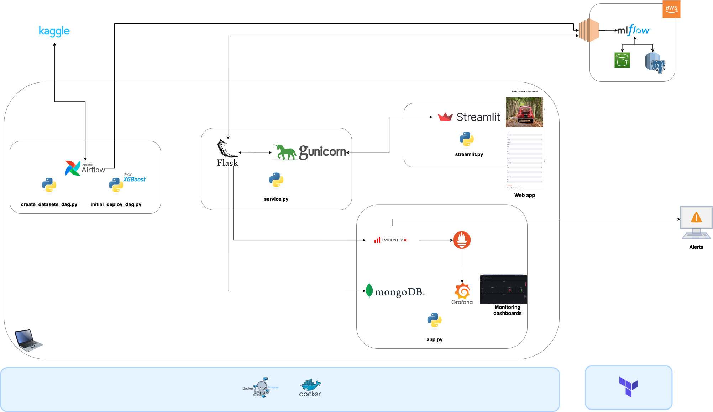

# MLOps Project - Vehicles Price


## Description

This project is created as the final project of the [MLOps Zoomcamp](https://github.com/DataTalksClub/mlops-zoomcamp), and it will be peer reviewed and scored.

The aim of the project is to build an end-to-end machine learning project.


## Dataset

This project gets data from [Kaggle](https://www.kaggle.com/datasets/austinreese/craigslist-carstrucks-data) and creates a model to predict the list price of vehicles on Craiglist.
This predicted value can help users to understand how much a vehicle is worth. For that, users can use a web app to input the characteristics of the given vehicle.


## System architecture and Technologies

The following figure depicts the system architecture:



The main technologies are the following ones:
* Cloud: AWS
* Experiment tracking and model registry: MLFlow
* Container: Docker + Docker Compose
* Infrastructure as code (IaC): Terraform
* Workflow orchestration: Airflow
* Storage: S3
* Monitoring: Evidently
* Web app: Flask + Gunicorn + Streamlit
* CI/CD: GitHub actions
* Linter and code formaters: Pylint + Black + isort


## Flow

Airflow orchestrates the download of the dataset from Kaggle, the modeling and deployment of the initial model, by using MLFlow for experiment tracking and model registry. The model is set to production stage. 
XGBoost is used for creating the model.
Some other tasks run in the background to guarantee that the entire service will run smoothly when started.

When the service boots, it obtains the model staged in production from MLFlow, starts the Flask app and Gunicorn for serving web requests, starts Evidently for monitoring the data input by the user, and starts Streamlit for the frontend, where the user can predict values for vehicles. 

Whenever the ratio of variables drifting passes a pre-defined threshold, it triggers alerts to the user. Meanwhile, drift reports can be observed using Grafana.

More info on the flow can be found [here](./setup/flow.md).


## Setup

This project has as main pre-requisites:
* AWS account
* Terraform
* Docker and Docker Compose

For more info on how to setup this architecture and run the code please check the following documentation:

1. [setup_aws_mlflow.md](./setup/setup_aws_mlflow.md)
2. [setup_kaggle.md](./setup/setup_kaggle.md)
3. [setup_terraform.md](./setup/setup_terraform.md)
4. [setup_env.md](./setup/setup_env.md)

You can run the project using:
```
make build
```


## Project Structure

The following is the resulting repo structure:

    ├── .github
    │   └── workflows                   <- CI/CD settings
    ├── airflow                         <- Docker and dags for initial deployment
    ├── evidently_service               <- Docker for running Evidently
    ├── imgs
    │   ├── frontend.png                <- Frontend image
    │   └── project_architecture.png    <- Project architecture
    ├── integration_tests               <- Integration tests
    ├── service                         <- Docker for web service app
    ├── setup                           <- Documentation for setting up the project
    ├── streamlit                       <- Docker for frontend app
    ├── terraform                       <- Terraform files
    ├── unit_tests                      <- Unit tests
    ├── .pre-commit-config.yaml         <- Docker settings for setting the initial deployment
    ├── Makefile                        <- Makefile with commands
    ├── Pipfile                         <- Dependencies and where to get them in
    ├── Pipfile.lock                    <- Concrete dependencies
    ├── README.md                       <- The top-level README of the project
    ├── docker-compose-airflow.yml      <- Docker settings for setting the initial deployment
    ├── docker-compose-service.yml      <- Docker settings for service deployment
    └── pyproject.toml                  <- Linter and code formatter settings