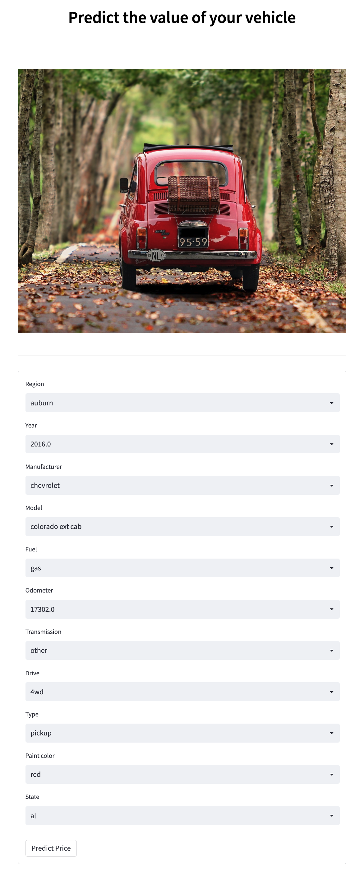
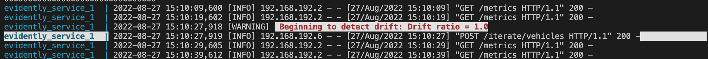
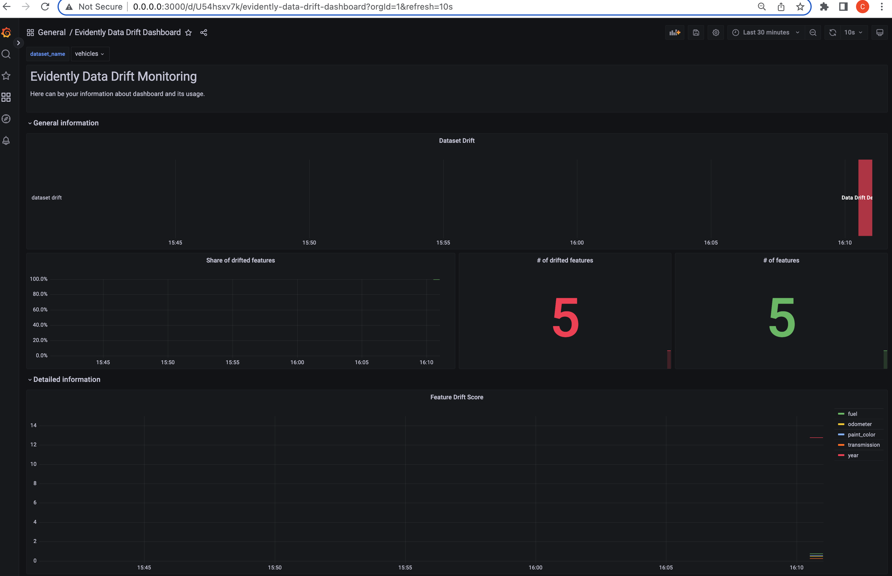
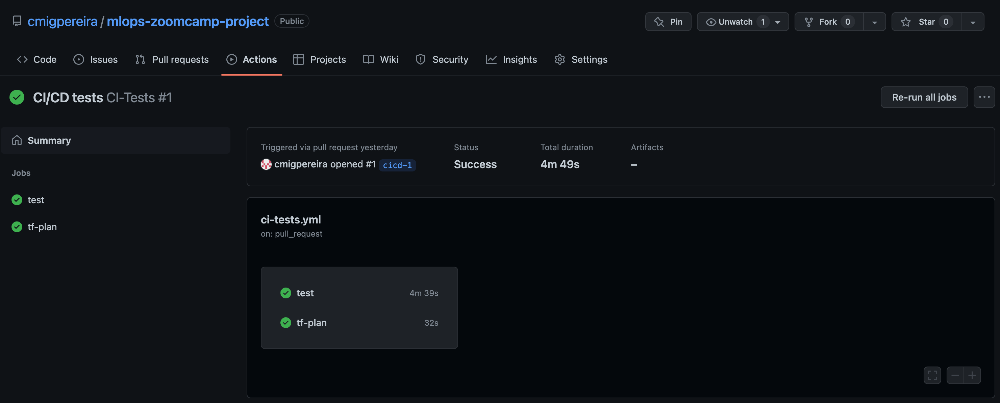
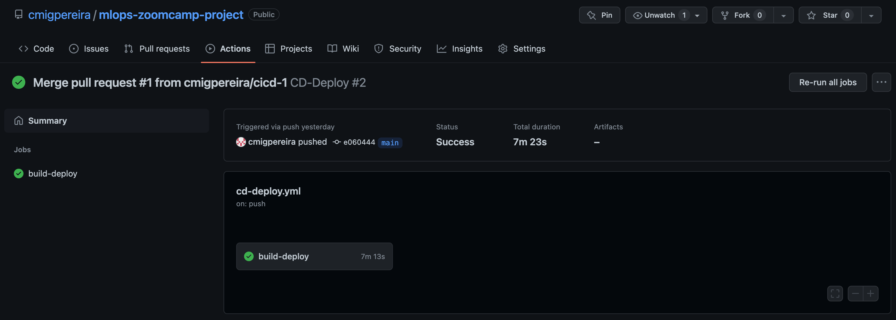

# Flow

## Airflow

The project is automated, which means that when makefile build is run, the dags run automatically. 
However, the Airflow UI can be accessed in port 8080, while the airflow docker is running. 
The username is `airflow` and the password is `airflow`.
On the view page you can see 2 dags:
* `creates_datasets_dag` for downloading data from the Kaggle API, splitting it in train, validation and test datasets; sends the train dataset for Evidently to be used as reference file;
* `initial_model_dag` using MLFlow experiment tracking and model registry, creates a XGBoost and sends the artifacts to MLFlow running at AWS.

The diagrams for each DAG can be seen on the [images folder](../imgs/).

## Frontend

The web app can be accessed using Streamlit at port 8501 and has the following looks:

## Monitoring

While the service is running, if the information that users input on the Frontend results in variable drifting, the service sends alerts like this:

Drift Monitoring reports can also be acessed in Grafana which runs in port 3000:

## CI/CD pipeline on GitHub

When CI/CD pipelines run properly, you will see similar information as the following:

