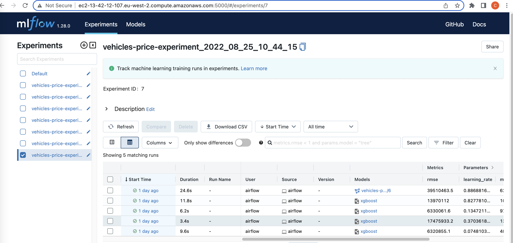
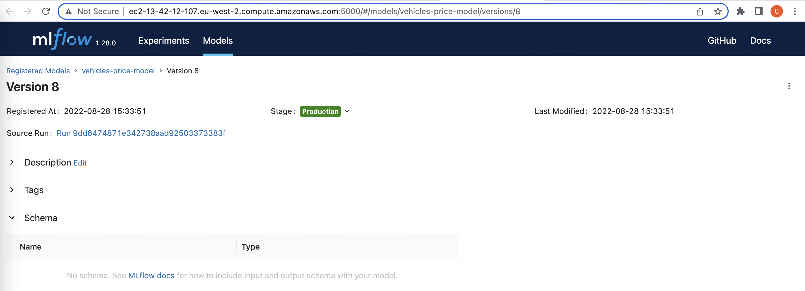
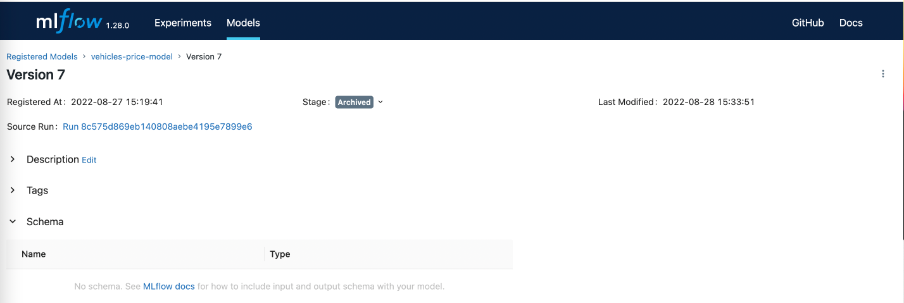

# Flow

## Airflow

The project is automated, which means that when makefile build is run, the dags run automatically. 
However, the Airflow UI can be accessed in port 8080, while the airflow docker is running. 
The username is `airflow` and the password is `airflow`.
On the view page you can see 2 dags:
* `creates_datasets_dag` for downloading data from the Kaggle API, splitting it in train, validation and test datasets; sends the train dataset for Evidently to be used as reference file;
* `initial_model_dag` using MLFlow experiment tracking and model registry, creates a XGBoost and sends the artifacts to MLFlow running at AWS.

The diagrams for each DAG can be seen on the [images folder](../imgs/).

## MLFlow

Experiments and their information can be accessed programatically or via a web-browser by connecting to the EC2 endpoint (created on [setup_aws_mlflow.md](../setup/setup_aws_mlflow.md)):

The models and their different stages can be accessed there as well.

When a new model is set to a production stage, the previous one is set to archived, as illustrated by the following two figures:

## Frontend

The web app can be accessed using Streamlit at port 8501 and has the following looks:

## Monitoring

While the service is running, if the information that users input on the Frontend results in variable drifting, the service sends alerts like this:

Drift Monitoring reports can also be acessed in Grafana which runs in port 3000:

## CI/CD pipelines on GitHub

The CI/CD pipelines are powered by GitHub Actions and are set to run for the main branch for demonstration purposes only. Consider changing this a development branch.
When CI/CD pipelines run properly, you will see similar information as the following:

