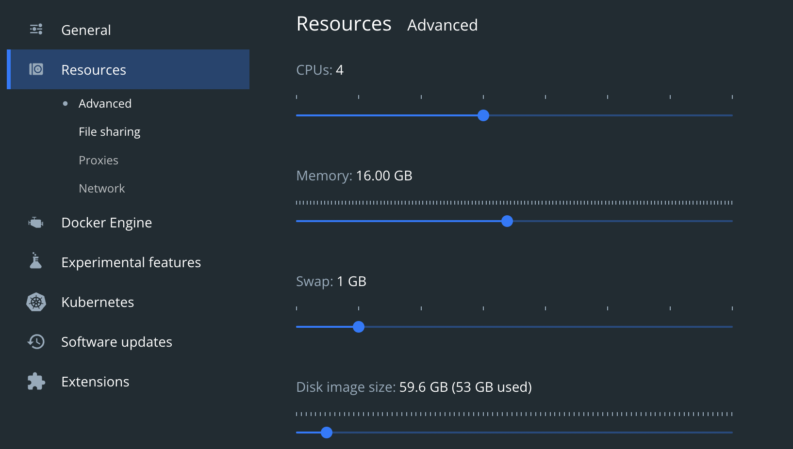
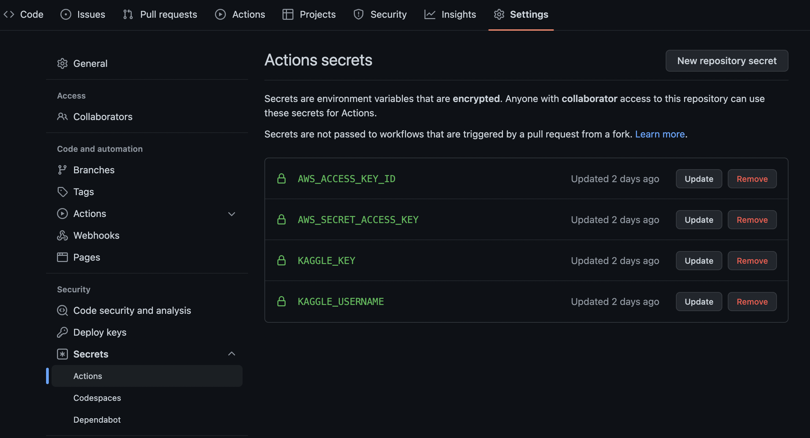

# Setup environments

## Python
---

Python 3.9 is required to run the system.
After Python is installed, run:
```
pip install -U pip --upgrade pip
pip install pipenv
```


## Docker
---

Docker needs to be provided with sufficient resources, specially for running the pipeline for downloading the dataset and creating the models.
The following configuration was used for running Docker locally:




## Environment variables
---

You need to export the necessary environment variables. The following shows an example using dummy info:
```
export AWS_ACCESS_KEY_ID=<YOUR AWS_ACCESS_KEY_ID>
export AWS_SECRET_ACCESS_KEY=<YOUR AWS_SECRET_ACCESS_KEY>
export AWS_REGION=<YOUR AWS_REGION>
export AWS_DEFAULT_REGION=<YOUR AWS_DEFAULT_REGION>
export KAGGLE_USERNAME=<YOUR KAGGLE_USERNAME>
export KAGGLE_KEY=<YOUR KAGGLE_KEY>
```

You can also add an environment variable for the S3 bucket that holds the MLFlow information and use it in the service's docker-compose-service.yml file. 
Currently, that bucket name is hardcoded both in the docker-compose-service.yml file and in the service.py file.


## GitHub secrets for CI/CD
---

For running the CI/CD pipelines, AWS and Kaggle credentials need to be inserted as secrets in GitHub as the following:


